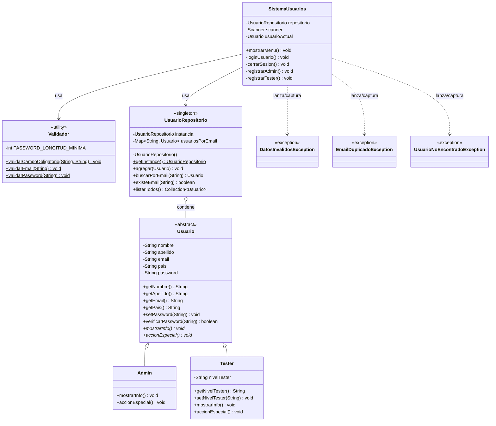

## Diagrama UML

```mermaid
classDiagram
    class Usuario {
        <<abstract>>
        -String nombre
        -String apellido
        -String email
        -String pais
        -String password
        +getNombre() String
        +getApellido() String
        +getEmail() String
        +getPais() String
        +setPassword(String) void
        +verificarPassword(String) boolean
        +mostrarInfo()* void
        +accionEspecial()* void
    }

    class Admin {
        +mostrarInfo() void
        +accionEspecial() void
    }

    class Tester {
        -String nivelTester
        +getNivelTester() String
        +setNivelTester(String) void
        +mostrarInfo() void
        +accionEspecial() void
    }

    class Validador {
        <<utility>>
        -int PASSWORD_LONGITUD_MINIMA
        +validarCampoObligatorio(String, String)$ void
        +validarEmail(String)$ void
        +validarPassword(String)$ void
    }

    class UsuarioRepositorio {
        <<singleton>>
        -UsuarioRepositorio instancia$
        -Map~String, Usuario~ usuariosPorEmail
        -UsuarioRepositorio()
        +getInstance()$ UsuarioRepositorio
        +agregar(Usuario) void
        +buscarPorEmail(String) Usuario
        +existeEmail(String) boolean
        +listarTodos() Collection~Usuario~
    }

    class SistemaUsuarios {
        -UsuarioRepositorio repositorio
        -Scanner scanner
        -Usuario usuarioActual
        +mostrarMenu() void
        -loginUsuario() void
        -cerrarSesion() void
        -registrarAdmin() void
        -registrarTester() void
    }

    class DatosInvalidosException {
        <<exception>>
    }
    class EmailDuplicadoException {
        <<exception>>
    }
    class UsuarioNoEncontradoException {
        <<exception>>
    }

    Usuario <|-- Admin
    Usuario <|-- Tester
    SistemaUsuarios --> UsuarioRepositorio : usa
    SistemaUsuarios --> Validador : usa
    UsuarioRepositorio o-- Usuario : contiene
    SistemaUsuarios ..> DatosInvalidosException : lanza/captura
    SistemaUsuarios ..> EmailDuplicadoException : lanza/captura
    SistemaUsuarios ..> UsuarioNoEncontradoException : lanza/captura
```
