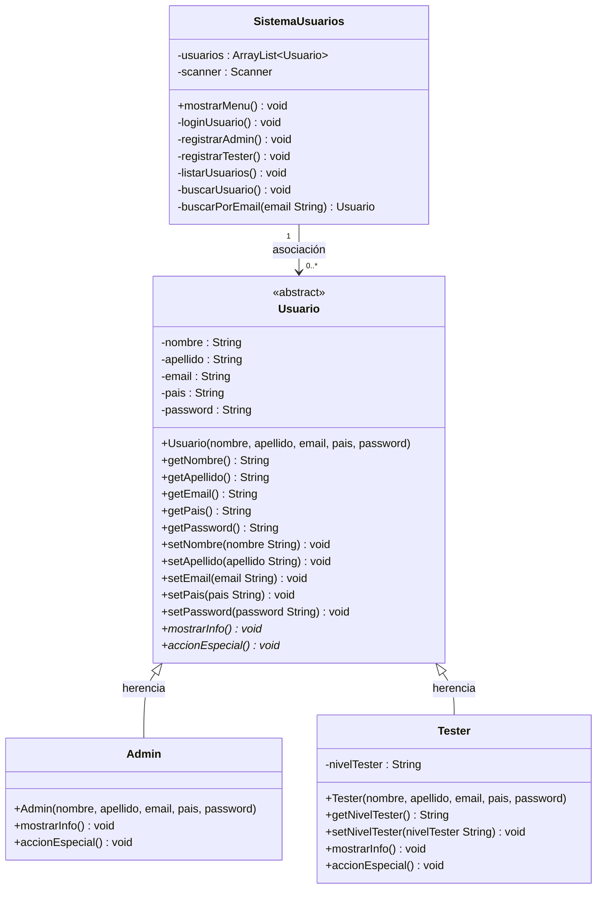

# Sistema de Usuarios

Proyecto Java que implementa un sistema de gestión de usuarios aplicando conceptos de Programación Orientada a Objetos: encapsulamiento, herencia, abstracción y polimorfismo.

## Funcionalidades

- **Login**: autenticación de usuarios registrados mediante email y contraseña.
- **Registro de administrador**: alta de nuevas cuentas de administrador con validación de email no repetido y confirmación de contraseña.
- **Registro de tester**: solo disponible para un administrador ya autenticado, permite dar de alta testers con su nivel correspondiente (Junior, Senior o Líder).
- **Listar usuarios**: muestra todos los usuarios registrados en el sistema.
- **Buscar usuario**: busca un usuario por su email y muestra su información.

## Estructura de clases

- `Usuario` (abstracta): clase base con los atributos comunes (nombre, apellido, email, país, contraseña) y los métodos abstractos `mostrarInfo()` y `accionEspecial()`.
- `Admin`: hereda de `Usuario`, representa a los administradores del sistema.
- `Tester`: hereda de `Usuario`, incorpora el atributo `nivelTester` (Junior, Senior o Líder).
- `SistemaUsuarios`: gestiona la colección de usuarios (`ArrayList<Usuario>`) y el menú de la aplicación.
- `Main`: punto de entrada del programa.

## Diagrama UML

