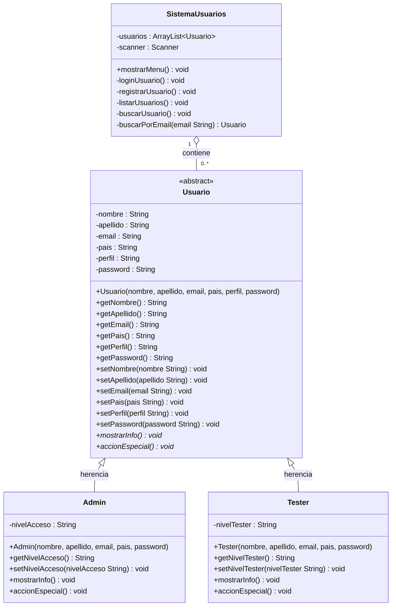

```mermaid
classDiagram
    class Usuario {
        -nombre : String
        -apellido : String
        -email : String
        -pais : String
        -perfil : String
        -password : String
        +Usuario(nombre, apellido, email, pais, perfil, password)
        +getNombre() String
        +getApellido() String
        +getEmail() String
        +getPais() String
        +getPerfil() String
        +getPassword() String
        +setNombre(nombre String) void
        +setApellido(apellido String) void
        +setEmail(email String) void
        +setPais(pais String) void
        +setPerfil(perfil String) void
        +setPassword(password String) void
        +mostrarInfo() void*
        +accionEspecial() void*
    }
    <<abstract>> Usuario

    class Admin {
        -nivelAcceso : String
        +Admin(nombre, apellido, email, pais, password)
        +getNivelAcceso() String
        +setNivelAcceso(nivelAcceso String) void
        +mostrarInfo() void
        +accionEspecial() void
    }

    class Tester {
        -nivelTester : String
        +Tester(nombre, apellido, email, pais, password)
        +getNivelTester() String
        +setNivelTester(nivelTester String) void
        +mostrarInfo() void
        +accionEspecial() void
    }

    class SistemaUsuarios {
        -usuarios : ArrayList~Usuario~
        -scanner : Scanner
        +mostrarMenu() void
        -loginUsuario() void
        -registrarUsuario() void
        -listarUsuarios() void
        -buscarUsuario() void
        -buscarPorEmail(email String) Usuario
    }

    Usuario <|-- Admin : herencia
    Usuario <|-- Tester : herencia
    SistemaUsuarios "1" o-- "0..*" Usuario : contiene
```
</pre>
