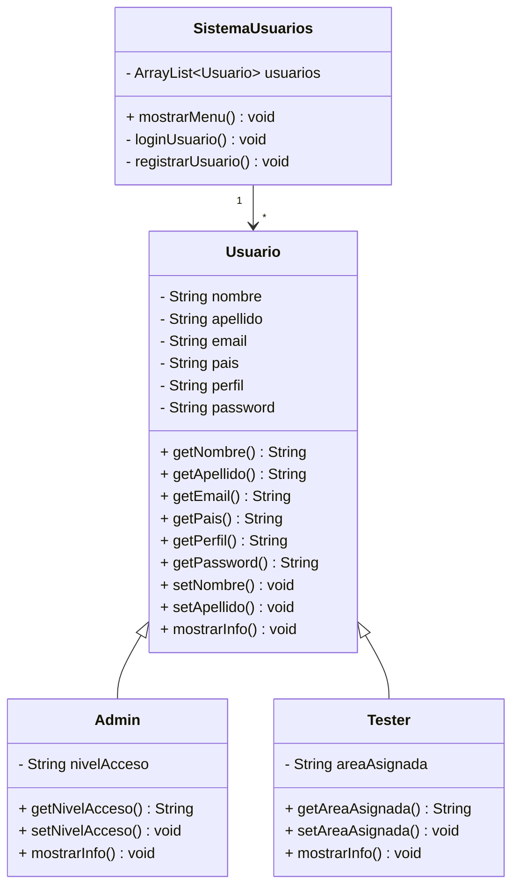

VC1 Funcionalidades, descripciones y datos 

Autenticación
- Login: Iniciar sesión como administrador (Email y Contraseña)
- Reiniciar contraseña: Recuperar cuenta (Email, Contraseña y Repetir contraseña)
- Logout: Cerrar sesión (Sí o Cancelar)

Gestión de cuentas
- Crear cuenta administrador: Dar alta de cuenta con Nombre, Apellido, Email, Contraseña, Repetir contraseña y País de nacimiento
- Crear cuenta tester: Dar alta de cuenta con Nombre, Apellido, Email, País de nacimiento, Contraseña por defecto y Perfil (Tester Junior, Tester Senior, Tester Líder)

Gestión de usuarios
- Ver usuarios: Ver usuarios registrados (Nombre, Apellido, Email, País, Perfil (Tester Junior/Senior/Líder o Administrador)
- (Derivado del anterior) Eliminar usuarios: Eliminar usuarios registrados en el sistema (Aceptar o Cancelar)
- Ver perfil de usuario: Ver detalles del perfil (Nombre, Apellido, Email, País, Perfil)
- (Derivado del anterior) Modificar datos de perfil de usuario: Cambiar detalles del perfil (Nombre, Apellido, Email, País, Perfil)


VC3 – Modelado con POO




VC 4 Diagrama UML

```mermaid
classDiagram
    class Usuario {
        -nombre : String
        -apellido : String
        -email : String
        -pais : String
        -perfil : String
        -password : String
        +Usuario(nombre, apellido, email, pais, perfil, password)
        +getNombre() : String
        +getApellido() : String
        +getEmail() : String
        +getPais() : String
        +getPerfil() : String
        +getPassword() : String
        +setNombre(nombre : String) : void
        +setApellido(apellido : String) : void
        +setEmail(email : String) : void
        +setPais(pais : String) : void
        +setPerfil(perfil : String) : void
        +setPassword(password : String) : void
        <<abstract>>
        +mostrarInfo() : void
        +accionEspecial() : void
    }

    class Admin {
        -nivelAcceso : String
        +Admin(nombre, apellido, email, pais, password)
        +getNivelAcceso() : String
        +setNivelAcceso(nivelAcceso : String) : void
        +mostrarInfo() : void
        +accionEspecial() : void
    }

    class Tester {
        -areaAsignada : String
        +Tester(nombre, apellido, email, pais, password)
        +getAreaAsignada() : String
        +setAreaAsignada(areaAsignada : String) : void
        +mostrarInfo() : void
        +accionEspecial() : void
    }

    class SistemaUsuarios {
        -usuarios : ArrayList<Usuario>
        -scanner : Scanner
        +SistemaUsuarios()
        +mostrarMenu() : void
        -loginUsuario() : void
        -registrarUsuario() : void
        -listarUsuarios() : void
        -buscarUsuario() : void
        -buscarPorEmail(email : String) : Usuario
    }

    Usuario <|-- Admin
    Usuario <|-- Tester
    SistemaUsuarios --> Usuario
